# Libraries 


```r
library(tidyverse)
library(biomaRt)
library(knitr)
library(kableExtra)
library(DEP)
```

```
## Warning in fun(libname, pkgname): mzR has been built against a different Rcpp version (0.12.16)
## than is installed on your system (1.0.0). This might lead to errors
## when loading mzR. If you encounter such issues, please send a report,
## including the output of sessionInfo() to the Bioc support forum at 
## https://support.bioconductor.org/. For details see also
## https://github.com/sneumann/mzR/wiki/mzR-Rcpp-compiler-linker-issue.
```

```r
library(readxl)
library(qvalue)
library(kableExtra)
library(naniar)
```

# 1 Preprocessing
Read data with gene names and GOs from biodbnet["https://biodbnet-abcc.ncifcrf.gov/db/db2db.php"].


```r
# Read data
data_raw <- read_tsv("proteinGroups_with_gene_names_and_GOs.txt")
```

```
## Parsed with column specification:
## cols(
##   .default = col_double(),
##   `Protein IDs` = col_character(),
##   `Majority protein IDs` = col_character(),
##   `Fasta headers` = col_character(),
##   `Only identified by site` = col_character(),
##   Reverse = col_logical(),
##   `Potential contaminant` = col_character(),
##   gene_name = col_character(),
##   alt_gene_names = col_character(),
##   bp_annotation = col_character(),
##   bp_annotation_id = col_character(),
##   cc_annotation = col_character(),
##   cc_annotation_id = col_character(),
##   kegg_annotation = col_character(),
##   kegg_annotation_id = col_character(),
##   mf_annotation = col_character(),
##   mf_annotation_id = col_character()
## )
```

```
## See spec(...) for full column specifications.
```

```
## Warning: 36 parsing failures.
##  row     col           expected actual                                        file
## 1197 Reverse 1/0/T/F/TRUE/FALSE      + 'proteinGroups_with_gene_names_and_GOs.txt'
## 1198 Reverse 1/0/T/F/TRUE/FALSE      + 'proteinGroups_with_gene_names_and_GOs.txt'
## 1199 Reverse 1/0/T/F/TRUE/FALSE      + 'proteinGroups_with_gene_names_and_GOs.txt'
## 1200 Reverse 1/0/T/F/TRUE/FALSE      + 'proteinGroups_with_gene_names_and_GOs.txt'
## 1201 Reverse 1/0/T/F/TRUE/FALSE      + 'proteinGroups_with_gene_names_and_GOs.txt'
## .... ....... .................. ...... ...........................................
## See problems(...) for more details.
```

```r
# Quick look at data columns
glimpse(data_raw)
```

```
## Observations: 3,477
## Variables: 36
## $ `Protein IDs`             <chr> "CON__ENSEMBL:ENSBTAP00000024146", "...
## $ `Majority protein IDs`    <chr> "CON__ENSEMBL:ENSBTAP00000024146", "...
## $ `Fasta headers`           <chr> NA, ";", NA, "; trypsinogen isoform ...
## $ Peptides                  <dbl> 4, 8, 6, 6, 4, 5, 12, 17, 1, 1, 5, 1...
## $ `Razor + unique peptides` <dbl> 1, 3, 1, 6, 3, 1, 5, 8, 1, 1, 2, 1, ...
## $ `Unique peptides`         <dbl> 1, 0, 1, 6, 3, 1, 4, 3, 1, 1, 1, 1, ...
## $ `LFQ intensity L_1312`    <dbl> 0.0000e+00, 3.3687e+07, 0.0000e+00, ...
## $ `LFQ intensity L_1313`    <dbl> 0, 0, 0, 3977000000, 0, 0, 27841000,...
## $ `LFQ intensity L_1326`    <dbl> 0, 26592000, 0, 3199000000, 0, 0, 40...
## $ `LFQ intensity L_1331`    <dbl> 0, 15657000, 0, 4496600000, 0, 0, 25...
## $ `LFQ intensity L_1488`    <dbl> 0, 0, 0, 3056000000, 0, 0, 17972000,...
## $ `LFQ intensity L_1492`    <dbl> 0, 25533000, 0, 3914300000, 0, 0, 50...
## $ `LFQ intensity L_1503`    <dbl> 0, 33040000, 0, 4879900000, 0, 0, 28...
## $ `LFQ intensity L_1506`    <dbl> 0, 0, 0, 4090700000, 0, 0, 36823000,...
## $ `LFQ intensity P_1311`    <dbl> 0, 0, 0, 2857400000, 0, 1498100, 198...
## $ `LFQ intensity P_1315`    <dbl> 0.0000e+00, 2.7457e+07, 0.0000e+00, ...
## $ `LFQ intensity P_1316`    <dbl> 0.0000e+00, 0.0000e+00, 0.0000e+00, ...
## $ `LFQ intensity P_1317`    <dbl> 0.0000e+00, 2.8221e+07, 0.0000e+00, ...
## $ `LFQ intensity P_1323`    <dbl> 0, 0, 0, 3769700000, 0, 0, 27786000,...
## $ `LFQ intensity P_1497`    <dbl> 0.0000e+00, 3.3001e+07, 0.0000e+00, ...
## $ `LFQ intensity P_1501`    <dbl> 0.0000e+00, 0.0000e+00, 0.0000e+00, ...
## $ `LFQ intensity P_1502`    <dbl> 0.0000e+00, 0.0000e+00, 0.0000e+00, ...
## $ `LFQ intensity P_1505`    <dbl> 2.5194e+07, 4.2765e+07, 1.7672e+07, ...
## $ `Only identified by site` <chr> "+", NA, NA, NA, NA, NA, NA, NA, NA,...
## $ Reverse                   <lgl> NA, NA, NA, NA, NA, NA, NA, NA, NA, ...
## $ `Potential contaminant`   <chr> "+", "+", "+", "+", "+", "+", "+", "...
## $ gene_name                 <chr> NA, NA, NA, "LOC100302368", NA, NA, ...
## $ alt_gene_names            <chr> "NA;NA;NA;NA;NA", "NA;NA;NA;NA;NA", ...
## $ bp_annotation             <chr> NA, NA, NA, NA, NA, NA, NA, NA, NA, ...
## $ bp_annotation_id          <chr> NA, NA, NA, NA, NA, NA, NA, NA, NA, ...
## $ cc_annotation             <chr> NA, NA, NA, NA, NA, NA, NA, NA, NA, ...
## $ cc_annotation_id          <chr> NA, NA, NA, NA, NA, NA, NA, NA, NA, ...
## $ kegg_annotation           <chr> NA, NA, NA, NA, NA, NA, NA, NA, NA, ...
## $ kegg_annotation_id        <chr> NA, NA, NA, NA, NA, NA, NA, NA, NA, ...
## $ mf_annotation             <chr> NA, NA, NA, NA, NA, NA, NA, NA, NA, ...
## $ mf_annotation_id          <chr> NA, NA, NA, NA, NA, NA, NA, NA, NA, ...
```

Remove all protein groups without a gene name (or locus name).


```r
filtered_data <- data_raw %>% 
  dplyr::filter(!is.na(gene_name))
```

Get gene names from biomaRt and replace any locus names with the new gene names.


```r
# Remove isoform from refseq identifier
filtered_data <- filtered_data %>%
  mutate(Protein_ID = str_extract(`Majority protein IDs`, "NP_[0-9]+|XP_[0-9]+"))
```

Extract gene names from biomart.


```r
# Find gene names using biomart
convert_NCBIIDs_to_gene_names(filtered_data$Protein_ID)

# Join with filtered data
filtered_data <- full_join(filtered_data, gene_names, by = "Protein_ID")
```

Replace loci and months with gene names from biomaRt (if any).


```r
data <- filtered_data %>% 
  rename(gene_name_biomart = Gene_name) %>%
  mutate(gene = if_else(str_detect(gene_name, "LOC.+") & !is.na(gene_name_biomart), gene_name_biomart, gene_name),
         gene = if_else(str_detect(gene, "[A-Za-z]+ [0-9]+"), gene_name_biomart, gene))
```


```r
# Make unique gene names (not sure if this is necessary with DEP)
data <- make_unique(data, "gene", "Protein_ID")
```

## Create experimental design

Create an experimental design file for `DEP`.


```r
library(readxl)

animal_list <- read_xlsx("Animal List young group.xlsx")

animal_list %>% 
  mutate(Group = str_extract(Group, "[A-Z]"),
         Gender = str_extract(Gender, "[a-z]"),
         Litter = str_extract(Litter, "[0-9]")) %>% 
  dplyr::filter(ID != 1495) %>% # Since it was a muscle sample
  unite(col = "label", Group, ID, sep = "_", remove = FALSE) %>% 
  unite(col = "group", Group, Gender, Series, Litter) %>% 
  rename(replicate = ID,
         condition = group) %>% 
  dplyr::select(label, condition, replicate) %>% 
  write_tsv("experimental_design_GIPR_liraglutide.txt")
```

Create a summarized experiment.


```r
# Grep for lfq columns
lfq_columns <- grep("LFQ.", colnames(data))

# Read experimental design
experimental_design <- read_tsv("experimental_design_GIPR_liraglutide.txt")
```

```
## Parsed with column specification:
## cols(
##   label = col_character(),
##   condition = col_character(),
##   replicate = col_double()
## )
```

```r
experimental_design
```

```
## # A tibble: 17 x 3
##    label  condition replicate
##    <chr>  <chr>         <dbl>
##  1 P_1311 P_m_1_1        1311
##  2 L_1312 L_f_1_1        1312
##  3 L_1313 L_f_1_1        1313
##  4 P_1315 P_f_1_1        1315
##  5 P_1316 P_f_1_1        1316
##  6 P_1317 P_f_1_1        1317
##  7 P_1323 P_m_1_2        1323
##  8 L_1326 L_m_1_2        1326
##  9 L_1331 L_f_1_2        1331
## 10 L_1488 L_m_2_3        1488
## 11 L_1492 L_m_2_3        1492
## 12 P_1497 P_f_2_3        1497
## 13 P_1501 P_m_2_4        1501
## 14 P_1502 P_m_2_4        1502
## 15 L_1503 L_m_2_4        1503
## 16 P_1505 P_f_2_4        1505
## 17 L_1506 L_f_2_4        1506
```

```r
# Generate summarized experiment
data_se <- make_se(data, lfq_columns, experimental_design)
data_se
```

```
## class: SummarizedExperiment 
## dim: 3416 17 
## metadata(0):
## assays(1): ''
## rownames(3416): LOC100302368 LOC110255272 ... TIMM9 L3HYPDH
## rowData names(24): Protein IDs Majority protein IDs ... name ID
## colnames(17): P_m_1_1_1311 L_f_1_1_1312 ... P_f_2_4_1505
##   L_f_2_4_1506
## colData names(4): label ID condition replicate
```

# 2 Analysis of summarized experiment

## 2.1 Missing value filtering

Plot protein identification overlap plot.


```r
plot_frequency(data_se)
```

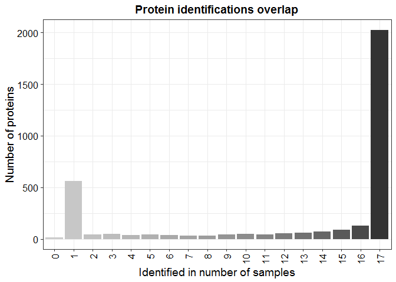<!-- -->

Filter data on valid values.


```r
# Calculate valid values per protein and treatment 
count_data <- data %>% 
  gather(`LFQ intensity L_1312`:`LFQ intensity P_1505`, key = "sample", value = "intensity") %>% 
  dplyr::select(name, sample, intensity) %>% 
  mutate(treatment = str_extract(sample, "[A-Z]_"),
         intensity = log2(intensity)) %>% 
  replace_with_na(replace = list(intensity = -Inf)) %>% 
  group_by(name, treatment) %>% 
  summarise(counts = sum(!is.na(intensity)))
```

I will choose valid values 5 per group, that was what I did last time in 
Perseus, and 1 missing value to compare with.


```r
# Filter for 5 valid values
list_5vv <- count_data %>% 
  spread(key = "treatment", value = "counts") %>% 
  dplyr::filter(L_ >= 5 | P_ >= 5)

# Filter for one missing value
list_1mv <- count_data %>% 
  spread(key = "treatment", value = "counts") %>% 
  dplyr::filter(L_ >= 7 | P_ >= 8)
```

## 2.2 Analysis of 5 valid values


```r
data_5vv <- left_join(list_5vv, data, by = "name")

# Grep for lfq columns
lfq_columns <- grep("LFQ.", colnames(data_5vv))

data_5vv_se <- make_se(data_5vv, lfq_columns, experimental_design)
```


```r
plot_frequency(data_5vv_se)
```

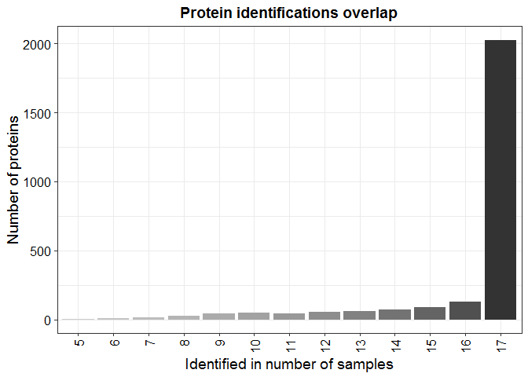<!-- -->

```r
plot_numbers(data_5vv_se)
```

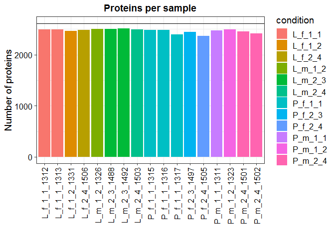<!-- -->

```r
plot_coverage(data_5vv_se)
```

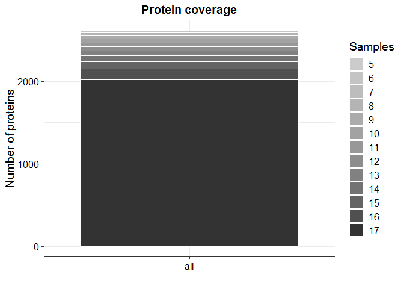<!-- -->

```r
plot_detect(data_5vv_se)
```

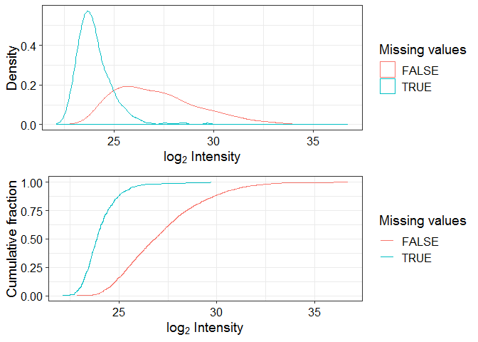<!-- -->

Normalize with `vsn`.


```r
data_5vv_norm <- normalize_vsn(data_5vv_se)
meanSdPlot(data_5vv_se)
```

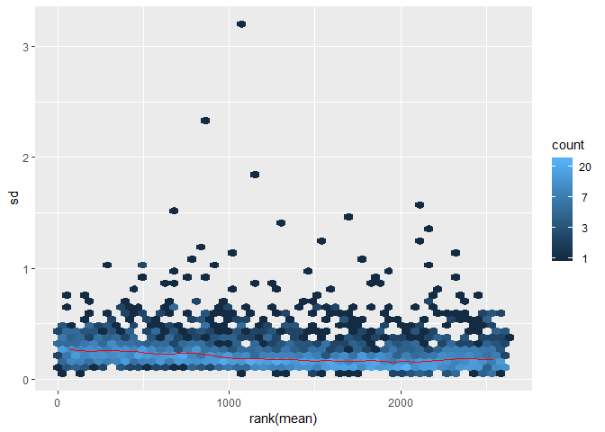<!-- -->

```r
meanSdPlot(data_5vv_norm)
```

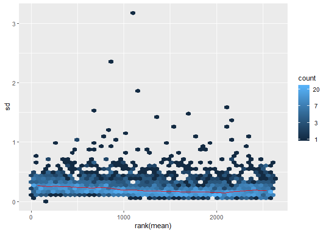<!-- -->

```r
plot_normalization(data_5vv_se, data_5vv_norm)
```

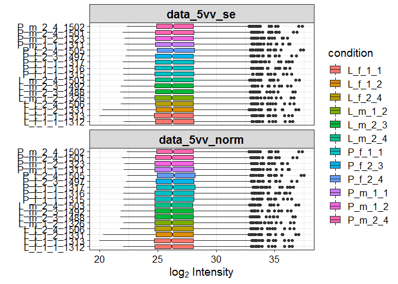<!-- -->


```r
plot_missval(data_5vv_norm)
```

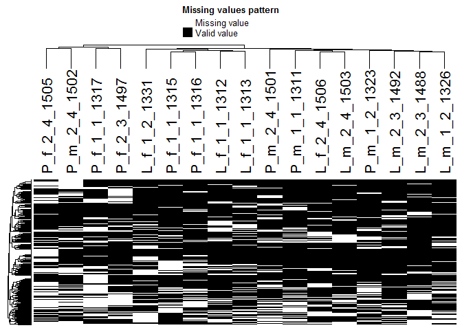<!-- -->

Imputation.


```r
imputed_data_5vv <- impute(data_5vv_norm, fun = "man", shift = 1.8, scale = 0.3)

plot_imputation(data_5vv_norm, imputed_data_5vv)
```

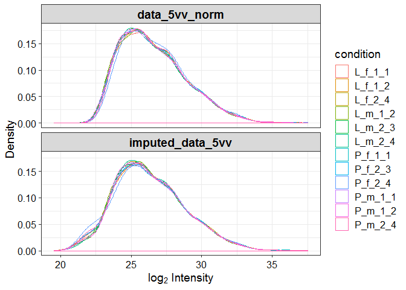<!-- -->

Save imputed data.


```r
imputed_data_5vv_long <- get_df_long(imputed_data_5vv)

write_tsv(imputed_data_5vv_long, "GIPR_liraglutide_liver_5vv_imputed.tsv")
```

## 2.2 Analysis of 5 valid values


```r
data_1mv <- left_join(list_1mv, data, by = "name")

# Grep for lfq columns
lfq_columns <- grep("LFQ.", colnames(data_1mv))

data_1mv_se <- make_se(data_1mv, lfq_columns, experimental_design)
```


```r
plot_frequency(data_1mv_se)
```

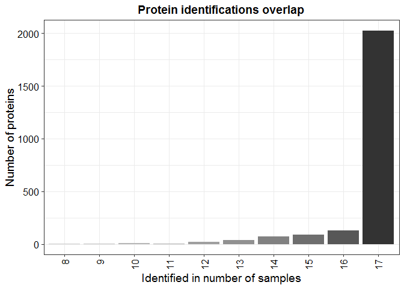<!-- -->

```r
plot_numbers(data_1mv_se)
```

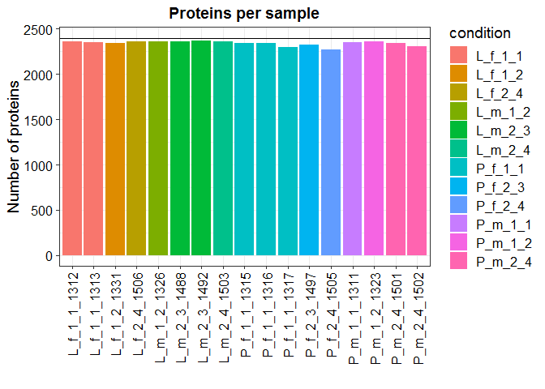<!-- -->

```r
plot_coverage(data_1mv_se)
```

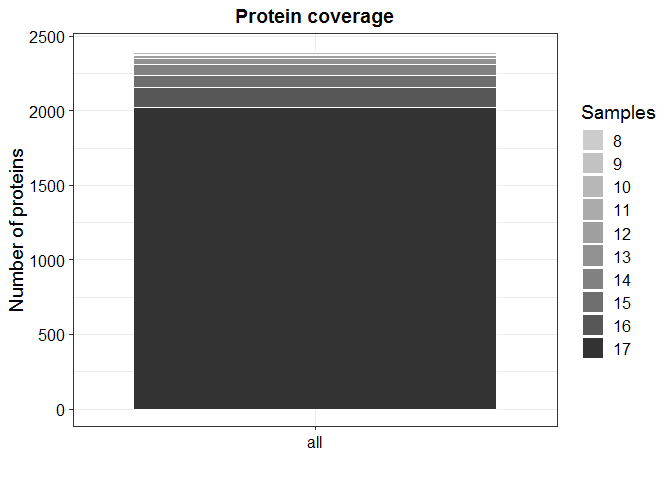<!-- -->

```r
plot_detect(data_1mv_se)
```

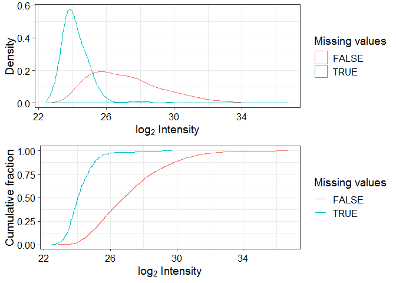<!-- -->

Normalize with `vsn`.


```r
data_1mv_norm <- normalize_vsn(data_1mv_se)
meanSdPlot(data_1mv_se)
```

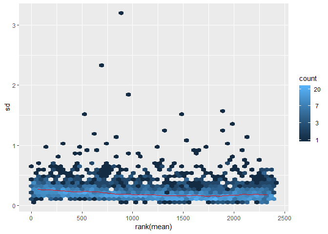<!-- -->

```r
meanSdPlot(data_1mv_norm)
```

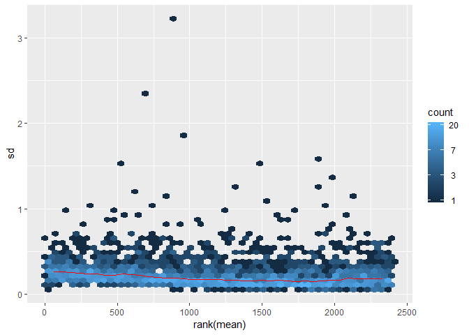<!-- -->

```r
plot_normalization(data_1mv_se, data_1mv_norm)
```

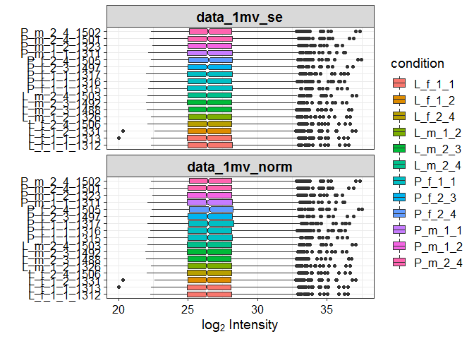<!-- -->


```r
plot_missval(data_1mv_norm)
```

<!-- -->

Imputation.


```r
imputed_data_1mv <- impute(data_1mv_norm, fun = "man", shift = 1.8, scale = 0.3)

plot_imputation(data_1mv_norm, imputed_data_1mv)
```

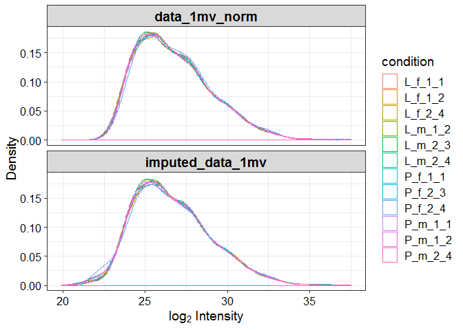<!-- -->

Save imputed data.


```r
imputed_data_1mv_long <- get_df_long(imputed_data_1mv)

write_tsv(imputed_data_1mv_long, "GIPR_liraglutide_liver_1mv_imputed.tsv")
```


